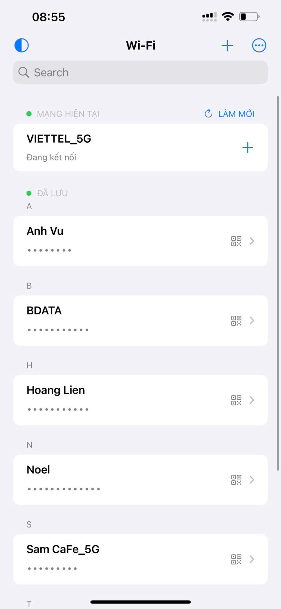
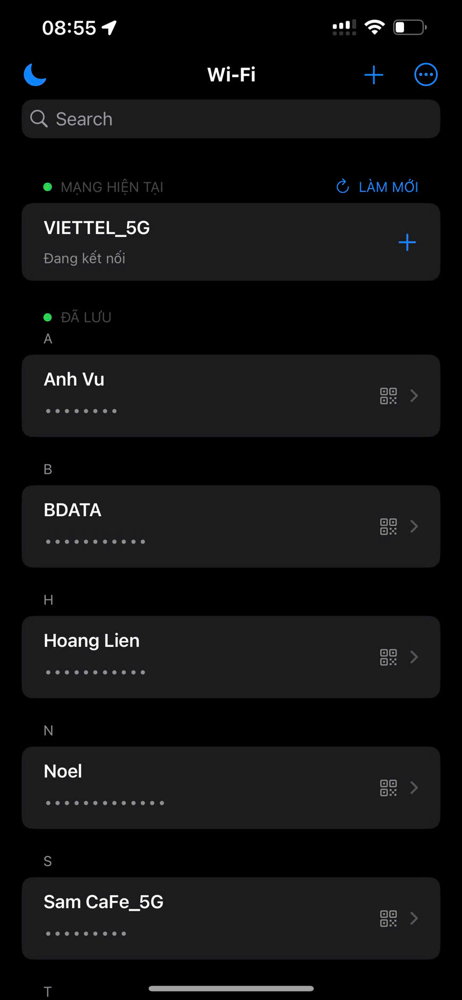
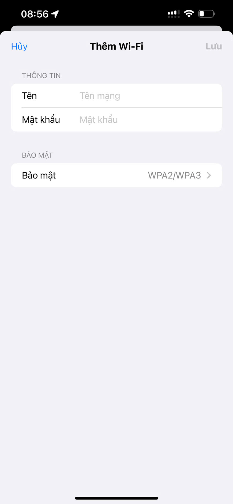
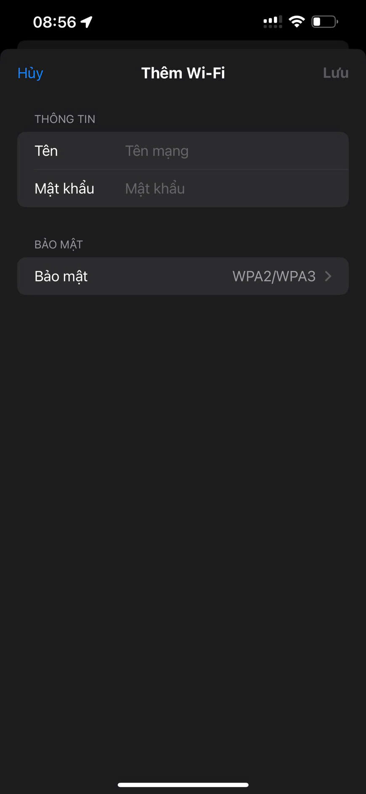
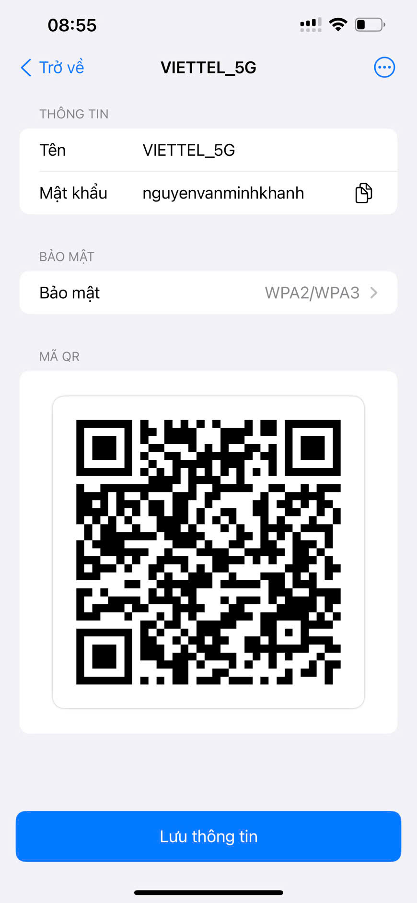
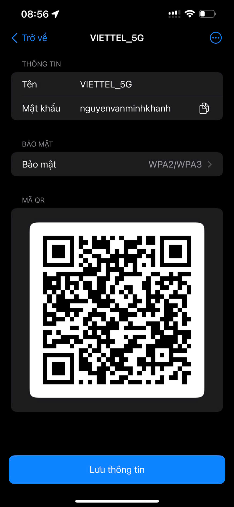

# 📶 WiFi Offline (Vibe Code)

Ứng dụng iOS (SwiftUI) giúp **lưu và quản lý mật khẩu Wi‑Fi** gọn nhẹ, riêng tư. Hỗ trợ tích hợp Firebase (yêu cầu cấu hình `GoogleService-Info.plist`).

## ✨ Tính năng
- Lưu/hiển thị mạng Wi‑Fi hiện tại
- Thêm, sửa, xoá Wi‑Fi
- Tìm kiếm nhanh
- Chia sẻ bằng QR Code
- Xuất dữ liệu dạng JS
- Đồng bộ từ Firebase về thiết bị
- Sao lưu dữ liệu từ thiết bị lên Firebase

## 🛠 Cài đặt (không cần macOS - yêu cầu phải có chứng chỉ)
1. Tải file IPA của ứng dụng.
2. Vào trang ký IPA: [IPASign](https://sign.ipasign.cc/).
3. Tải lên `IPA`, chứng chỉ `p12` và `mobileprovision` → chọn “Sign it now!”.
4. Quét QR hoặc dùng link cài đặt từ trang để cài trên iPhone/iPad.

## 🔧 Firebase (tuỳ chọn)
- Thay `GoogleService-Info.plist` bằng tệp từ dự án Firebase của bạn.
- Mở app và sử dụng. Không cần Xcode nếu cài qua IPA.
- Hỗ trợ đồng bộ dữ liệu từ Firebase về local và sao lưu ngược lại khi cần.

## 📱 Giao diện

### Màn hình chính
| Chế độ sáng | Chế độ tối |
|-------------|------------|
|  |  |

### Thêm Wi‑Fi mới
| Chế độ sáng | Chế độ tối |
|-------------|------------|
|  |  |

### Chi tiết Wi‑Fi
| Chế độ sáng | Chế độ tối |
|-------------|------------|
|  |  |

## Yêu cầu
- iOS 16.0+

## Giấy phép
MIT License

—
Made with ❤️ by [MinhKhanh‑EternAI](https://github.com/MinhKhanh-EternAI)
